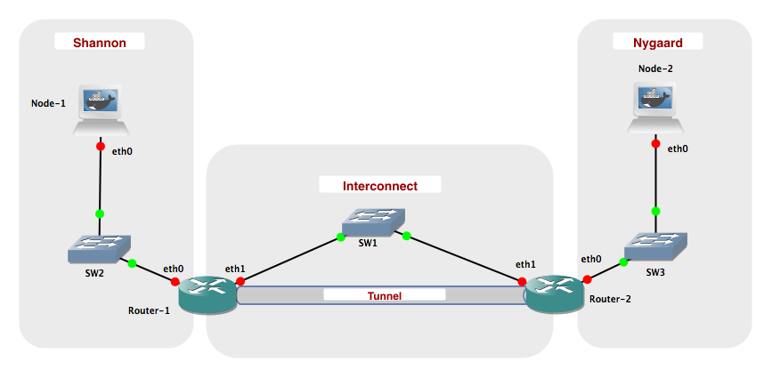
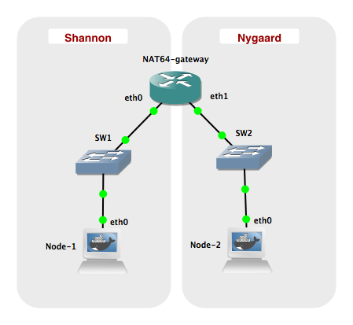

# Workshop 2: IPv6 transition mechanisms

[ [Back to Root page](https://github.com/rhjacobsen/CN_workshops/blob/master/README.md) ]

The goal of this workshop is to get hands-on experience with IPv4-IPv6 transition mechanisms. The workshop consists of two parts. The first part deals with simple IPv6-in-IPv4 tunnelling, while the second part explores a protocol translation mechanism.

TIP: You may consider to split the configurations into two different topology projects (labs).

## Part 1: Simple tunnel setup

We first consider the process of setting up a single IPv6-in-IPv4 tunnel. The IPv6-in-IPv4 tunnel allows connections to IPv6 networks through IPv4 networks. This is what is typically used today when connecting to IPv6 networks through the Internet.

### Lab overview

#### Network topology



#### Networks

| Name         | Network
|--------------|--------------------------
| Interconnect | 10.0.0.0 / 24
| Shannon      | 2001:878:402:1::0 / 64
| Nygaard      | 2001:878:402:2::0 / 64
| Tunnel       | 2001:878:402:3::0 / 64

### Creating the lab

The laboratory shall be configured with the following IP addresses:


| Network  Node	| eth0                   | eth1
|---------------|------------------------|------------------
| Node-1	      | 2001:878:402:1:XX / 64 | N/A
| Node-2	      | 2001:878:402:2:XX / 64 | N/A
| Router-1      | 2001:878:402:1::1 / 64 | 10.0.0.1 / 24
| Router-2      | 2001:878:402:2::1 / 64 | 10.0.0.2 / 24

An XX in an IPv6 address means that the interface is configured using stateless autoconfiguration and will configure an address with the prefix given to the router on the corresponding network. You may what to consult Workshop 1 to recap how this is done.

Try to ping following:

* Router-1 (eth0) <-> Node-1 (eth0)
* Router-1 (eth1) <-> Router-2 (eth1)
* Router-2 (eth0) <-> Node-2 (eth0)

This should work without any problems when the interfaces have been configured correctly.

> ##### Challenge 2.1
> Explain why you cannot ping eth1 of "Router-1" from "Node-1"?
> ```
>
>
>
>
>
>
> ```

### Tunneling

Now, we setup a 6-in-4 tunnel between "Router-1" and "Router-2", such that "Node-1" and "Node-2" can communicate using IPv6.

Login to "Router-1" and execute the following commmand:

    iptunnel add tun0 mode sit ttl 64 remote 10.0.0.2 local 10.0.0.1

This will create a virtual network interface called tun0. The tunnel uses sit mode, which stands for Simple Internet Transition. Packets sent to the interface are encapsulated in IPv4 packets and send to the remote endpoint (10.0.0.2). IPv4 packets containing IPv6 packets received on the local endpoint (10.0.0.1) are decapsulated and delivered through the tunnel interface. The ttl 64 specifies that the TTL of the generated IPv4 packets is to be set to 64.

Setup an IPv6 address on the tun0 interface:

    ip addr add 2001:878:402:3::1/64 dev tun0
    ip link set up tun0

Note that we are using a new network prefix rather than one of the two already used. This makes the interface easier to use, as all packets for the 2001:878:402:3/64 prefix are automatically routed to the tun0 interface.

Login to "Router 2" and create the other endpoint of the tunnel:

    iptunnel add tun0 mode sit ttl 64 remote 10.0.0.1 local 10.0.0.2
    ip addr add 2001:878:402:3::2/64 dev tun0
    ip link set up tun0

Ensure that you can ping 2001:878:402:3::1 from "Router 2".

> ##### Challenge 2.2
> Currently, it is not possible to ping 2001:878:402:1::1 from "Router 2". Briefly explain why.
> ```
>
>
>
>
>
>
> ```

On "Router 1" add a route to the 2001:878:402:2::/64 network by running:

    ip -6 route add 2001:878:402:2::/64 via 2001:878:402:3::2

On "Router 2" add a route to the 2001:878:402:1::/64 network:

    ip -6 route add 2001:878:402:1::/64 via 2001:878:402:3::1

Ensure that you can ping 2001:878:402:1::1 from both "Router-2" and "Node-2".

Use the command ```ip -6 route``` to inspect the routing tables on "Router-1" and "Router-2", and observe how the tunnel endpoints are being used as interfaces.

Lastly, add the default route on Node-1

    ip -6 route replace default via 2001:878:402:1::1

and Node-2

     ip -6 route replace default via 2001:878:402:2::1

Start Wireshark, and capture packets from the IPv4 Network: Interconnect. Ping "Node-2" from "Node-1".

After a couple of ping requests have been answered, stop the ping and Wireshark capture.

Inspect the ping packets captured.

> ##### Challenge 2.3
> Explore and briefly explain the structure of the ping packets captured using Wireshark. Expand one of the messages and examine its content.
> ```
>
>
>
>
>
>
>
>
>
> ```

Stop the laboratory.

## Part 2: Protocol translation

In this part, we will use protocol translation mechanisms to provide interworking between IPv6 and IPv4. We will use a mechanism calles stateless NAT64 (actually it is SIIT). On Linux this is provided by the Tayga software package.

TAYGA is an out-of-kernel stateless NAT64 implementation for Linux that uses the TUN driver to exchange IPv4 and IPv6 packets with the kernel. It is intended to provide production-quality NAT64 service for networks where dedicated NAT64 hardware would be overkill.

### Lab overview

#### Setup



#### Network

| Name             | Network
|------------------|--------------------------
| Shannon          | 2001:db8:1:1::0 / 64
| Nygaard          | 192.168.1.0 / 24
| Nygaard IPv6 NAT | 2001:db8:1:ffff::0 / 96
| NAT Pool         | 192.168.255.0 / 24

### Creating the lab

Configure the interfaces given in the table below:

| Network Node  | eth0                 | eth1             |
|---------------|----------------------|------------------|
| Node 1        | 2001:db8:1:1::2 / 64 | N/A              |
| Node 2        | 192.168.1.2 / 24     | N/A              |
| NAT64 gateway	| 2001:db8:1:1::1 / 64 | 192.168.1.1 / 24 |


### NAT64 with Tayga

Before starting the TAYGA daemon, the routing setup on your NAT64 gateway will need to be changed to allow sending IPv4 and IPv6 packets to TAYGA.

Make a configuration file ```/usr/local/etc/tayga.conf``` with the following content:

    tun-device nat64
    ipv4-addr 192.168.255.1
    prefix 2001:db8:1:ffff::/96
    dynamic-pool 192.168.255.0/24
    data-dir /var/spool/tayga

Then create the TUN network interface.

    tayga --mktun

Enable datagram forwarding on interfaces on NAT64 gateway:

    sysctl -w net.ipv6.conf.all.forwarding=1
    sysctl -w net.ipv4.ip_forward=1

Define a new interface on the NAT64 gateway and assign an IPv4 as well as an IPv6 address to the interface:

    ip link set nat64 up
    ip addr add 192.168.0.1 dev nat64
    ip addr add 2001:db8:1::1 dev nat64

Setup static routes to ensure that traffic is routed to the new interface.

    ip -6 route add 2001:db8:1:ffff::/96 dev nat64
    ip route add 192.168.255.0/24 dev nat64

Finally, start the NAT64 gateway application by using the command

    tayga -d &

Inspect the new interface by using ifconfig nat64. On the NAT64 gateway try to ping6 2001:db8:1:ffff::192.168.0.1. If it succeeds, Tayga is running properly.

Add default gateway routes to Node-1 and Node-2, respectively:

    ip -6 route replace default via 2001:db8:1:1::1      (Node 1)
    ip route replace default via 192.168.1.1             (Node 2)


> ##### Challenge 2.4
> Try to ping Node-2 from Node-1. What address should you ping and what is the results?
> ```
>
>
>
>
>
>
>
>
>
> ```


> ##### Challenge 2.5
> Inspect the file /var/spool/tayga/dynamic.map and explain its content and function?
> ```
>
>
>
>
>
>
>
>
>
> ```


The program tcpdump can be used as an alternative to Wireshark for capturing packets. Packet capture files can be stored and loaded into Wireshark for a more user-friendly presentation. An example of use is ```tcpdump -i eth0 -w /data/mycapture.pcap```, that will dump all packets that passes the eth0 interface to the file mycapture.pcap. Press Ctrl-C to end the packet capture. Check the [FAQ](https://github.com/rhjacobsen/CN_workshops/blob/master/Workshops/FAQ.md) on how to extract the capture will from the GNS3 VM.

TIPS: You may use ```tcpdump -c 5``` to limit the number of packets (e.g., 5 packets) to be captured. Note also that the ```tcpdump -r``` option allows you to read a .pcap file and print it to the console. Remember to pay attention to the interface you are listening on.


> ##### Challenge 2.6
> Capture packets sent over the nat64 interface for traffic sent between Node-1 and Node-2. Explain the content of the packet capture and clarify the main differences from a similar setup using 1) pure IPv4 networking and 2) pure IPv6 networking.
> ```
>
>
>
>
>
>
>
>
>
> ```

Optional: You may confirm that Node-1 recieves the pings from Node-2 by making a packet capture on Node-1's eth0.
